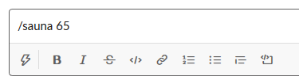
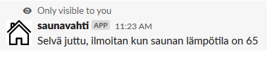
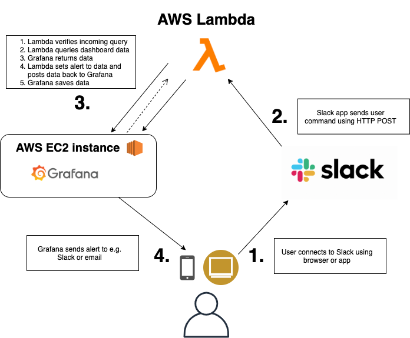

# serverless-grafana-alerts
Creates alerts to Grafana using AWS Lambda and Serverless framework. Uses Slack as a client. 

You can setup Grafana to AWS EC2 using [ruuvitag-aws-provisioning](https://github.com/pihlajus/ruuvitag-aws-provisioning)
project.

## Contents
- [How it works](#how-it-works)
- [Data flow](#data-flow)
- [Prerequisites](#prerequisites)
  * [Slack application](#slack-application)
  * [AWS account](#aws-account)
- [Configuration](#configuration)
- [Running](#running)
  * [Running offline](#running-offline)
  * [Deployment](#deployment)
- [Security](#security)

## How it works
**Enter your command to Slack:**  

**Lambda replies and Slack renders the reply:**  

##Data flow

There is no possibility to create an alert using alert API in Grafana so you have to use
[dashboard API](https://grafana.com/docs/grafana/latest/http_api/dashboard/) to create alerts. The
used solution is to fetch the whole dashboard JSON, create and add alert using template
and post the modified JSON back to dashboard API.

## Prerequisites

### Slack application
Slack is free to use and you can create [Slack application](https://api.slack.com/apps) very quickly and
without any programming. This application works as bot and you can create alerts to Grafana
using simple commands like `/sauna 60`. Just define "Incoming Webhook" and paste the Lambda API URL.

You can of course make you own HTTP client or use some other tool, just remember to modify the request
validation part.

### AWS account
You have to have AWS account and IAM user which can be used with [Serverless framework](https://serverless.com/). 

## Configuration
There are few environment variables to be filled in [serverless.yml](serverless.yml):

| Variable      | Description   |        
| ------------- | ------------- | 
| GRAFANA_API_KEY | API key that enables Grafana API usage | 
| SLACK_SIGNING_SECRET | Created automatically by Slack app, enables request verification | 
| GRAFANA_DASHBOARD_API | Grafana API url | 
| GRAFANA_DASHBOARD_UID | Grafana dashboard UID | 

If you are using some domain name and want to utilize serverless domain manager (recommended)
put you domain info to "customDomain" part in [serverless.yml](serverless.yml).

## Running

### Running offline
You can test application using [serverless-offline](https://github.com/dherault/serverless-offline)
using command `sls offline start` or via npm `npm run start`.

### Deployment
Serverless applicatons are easy to deploy, just run `sls deploy`. If you are using
your own domain name [serverless domain manager plugin](https://github.com/amplify-education/serverless-domain-manager)
takes care of deployment details.

## Security
Slack sends signature header with POST request and this signature can be validated
using Slack signing secret (see [verifySlackSignature](./src/slackUtils.ts) function).
